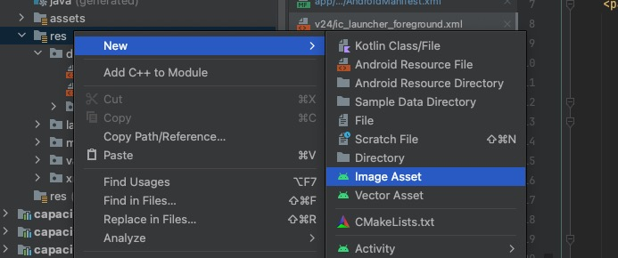

# capacitor-plugin-playlist

Will probably be published as @dwbn/capacitor-playlist

A capacitor plugin for Android, iOS and Web with native support for audio playlists, background support, and lock screen controls

## 0. Index

1. [Background](#1-background)
2. [Notes](#2-notes)
3. [Installation](#3-installation)
4. [Usage](#4-usage)
5. [Todo](#5-todo)
6. [Credits](#6-credits)
7. [License](#7-license)

## 1. Background

I was using very successfuly cordova-plugin-playlist, many thanks to codinronan an all the contributors!!
Due to upgrades and further development of the app, which used the plugin we decided to go for capacitor instead of
cordova, and here we wanna give back to the community our outcome, any help is appreciated!

## 2. Notes

### On _Android_, utilizes a wrapper over ExoPlayer called [ExoMedia](https://github.com/brianwernick/ExoMedia). ExoPlayer is a powerful, high-quality player for Android provided by Google

### On iOS, utilizes a customized AVQueuePlayer in order to provide feedback about track changes, buffering, etc.; given that AVQueuePlayer can keep the audio session running between songs.

- This plugin is not designed to play mixable, rapid-fire, low-latency audio, as you would use in a game. A more appropriate cordova plugin for that use case is [cordova-plugin-nativeaudio](https://github.com/floatinghotpot/cordova-plugin-nativeaudio)

- Cannot mix audio; again the NativeAudio plugin is probably more appropriate. This is due to supporting the lock screen and command center controls: only an app in command of audio can do this, otherwise the controls have no meaning. I would like to add an option to do this, it should be fairly straightforward; at the cost of not supporting the OS-level controls for that invokation.

## 3. Installation

As with most capacitor plugins...

```
npm i capacitor-plugin-playlist
npx cap sync
```

### For web

include hlsjs in your build

#### E.G. for Angular 2+:

```
npm i hls.js
```

then add to angular.json:
architect => build => options:

```
    "scripts": [
      {
        "input": "node_modules/hls.js/dist/hls.min.js"
      }
    ]
```

##### AndroidManifest.xml:

```
    <uses-permission android:name="android.permission.WAKE_LOCK" />
    <uses-permission android:name="android.permission.FOREGROUND_SERVICE" />
    <application
        android:name="org.dwbn.plugins.playlist.App"
    >
        <service android:enabled="true" android:exported="false"
                 android:name="org.dwbn.plugins.playlist.service.MediaService">
        </service>
    </application>
```

##### Glide image loading for notifiction center

To be able to use glide you need to create a file MyAppGlideModule.java:

```
package org.your.package.namespace;

import com.bumptech.glide.annotation.GlideModule;
import com.bumptech.glide.module.AppGlideModule;

@GlideModule
public final class MyAppGlideModule extends AppGlideModule {}
```

also see https://guides.codepath.com/android/Displaying-Images-with-the-Glide-Library

### iOS

##### inside Info.plist:

```
	<key>UIBackgroundModes</key>
	<array>
		<string>audio</string>
		<string>fetch</string>
	</array>
```

Android normally will give you ~2-3 minutes of background playback before killing your audio. Adding the WAKE_LOCK permission allows the plugin to utilize additional permissions to continue playing.

iOS will immediately stop playback when the app goes into the background if you do not include the `audio` `UIBackgroundMode`. iOS has an additional requirement that audio playback must never stop; when it does, the audio session will be terminated and playback cannot continue without user interaction.

### Android notification icon

To show a better notification icon in Android Lollipop (API 21) and above, create a transparent (silhouette) icon and name the file e.g. as "ic_notification.png".
Then you can use the options like:

```
await Playlist.setOptions({
  verbose: !environment.production,
  options: {
    icon: 'ic_notification'
  },
});
```

In Android Studio, you can right-click on `res` folder and choose `New > Image Asset`:



Select type: `Notification Icons` and choose your icon, click `Next` to save it.


## 4. Usage

Be sure to check out the examples folder, where you can find an Angular10/Ionic5 implementation of the Capacitor plugin.
Just drop into your project and go.
Should be quite obvious howto adapt this for other frameworks, or just vanillaJS

### API

Example:
@see definition.ts

```
import {Playlist, AudioTrack} from 'capacitor-plugin-playlist'

const item: AudioTrack = {
    trackId: 1,
    assetUrl: 'http://your_audio',
    albumArt: 'http://some_image'
}
await Playlist.addItem({item})
```

- TODO!

### Migrating from cordova-plugin-playlist

See the use the shipped RmxAudioPlayer.ts

Its a meant as a drop in replacement

in the best case you only change your import. :D

## 5. Todo

- [iOS] Utilize [AudioPlayer](https://github.com/delannoyk/AudioPlayer) instead of directly implementing AVQueuePlayer. `AudioPlayer` includes some smart network recovery features
- [iOS, Android] Add a full example

## 6. Credits

There are several plugins that are similar to this one, but all are focused on aspects of the media management experience. This plugin takes inspiration from:

- [cordova-plugin-playlist](https://github.com/Rolamix/cordova-plugin-playlist)
- [cordova-plugin-media](https://github.com/apache/cordova-plugin-media)
- [ExoMedia](https://github.com/brianwernick/ExoMedia)
- [PlaylistCore](https://github.com/brianwernick/PlaylistCore) (provides player controls on top of ExoMedia)
- [Bi-Directional AVQueuePlayer proof of concept](https://github.com/jrtaal/AVBidirectionalQueuePlayer)
- [cordova-music-controls-plugin](https://github.com/homerours/cordova-music-controls-plugin)

## 7. License

[The MIT License (MIT)](http://www.opensource.org/licenses/mit-license.html)

Permission is hereby granted, free of charge, to any person obtaining a copy
of this software and associated documentation files (the "Software"), to deal
in the Software without restriction, including without limitation the rights
to use, copy, modify, merge, publish, distribute, sublicense, and/or sell
copies of the Software, and to permit persons to whom the Software is
furnished to do so, subject to the following conditions:

The above copyright notice and this permission notice shall be included in
all copies or substantial portions of the Software.

THE SOFTWARE IS PROVIDED "AS IS", WITHOUT WARRANTY OF ANY KIND, EXPRESS OR
IMPLIED, INCLUDING BUT NOT LIMITED TO THE WARRANTIES OF MERCHANTABILITY,
FITNESS FOR A PARTICULAR PURPOSE AND NONINFRINGEMENT. IN NO EVENT SHALL THE
AUTHORS OR COPYRIGHT HOLDERS BE LIABLE FOR ANY CLAIM, DAMAGES OR OTHER
LIABILITY, WHETHER IN AN ACTION OF CONTRACT, TORT OR OTHERWISE, ARISING FROM,
OUT OF OR IN CONNECTION WITH THE SOFTWARE OR THE USE OR OTHER DEALINGS IN
THE SOFTWARE.
